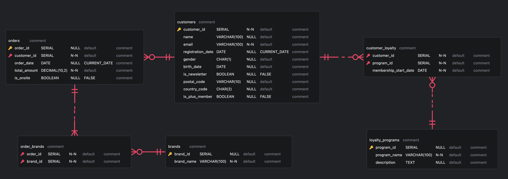

# Segmenting Customers of an Online Fashion Retailer 

1. Generates random data using Python.
2. Builds a local PostgreSQL database.
3. Plots entity-relationship diagram (ERD).
3. Segments customers using Recency-Frequency-Monetary (RFM) and K-Means Clustering models.

.

<div style="border-left: 10px solid #ff6900; padding-left: 15px;">

## Executive Report 

**Objective:** Identify distinct customer segments, develop targeted marketing strategies, A/B test the strategies (not part of this project).

**Methodology:** Queried customers and orders database for demographics, purchasing data, membership statuses (plus, loyalty programs, newsletter) and segmented the data.

**Results:** Following customer segments were identified with actionable insights for boosting customer value and retention.

**Customer Segments (Recency-Frequency-Monetary):**
<table>
  <tr>
    <th>Segment</th>
    <th>Description</th>
    <th>Action</th>
  </tr>
  <tr>
    <td>Champion</td>
    <td>Best customers. Buys often and big. Has purchased recently.</td>
    <td>Analyze them to better understand our product-market fit and main buying personas.</td>
  </tr>
  <tr>
    <td>Potential Loyalist</td>
    <td>Similar to a champion but with smaller order size and frequency.</td>
    <td>Target them with a loyalty program.</td>
  </tr>
  <tr>
    <td>New Customer</td>
    <td>Recent purchase, but little to no order history.</td>
    <td>Introduce them to our website (e.g., style advice).</td>
  </tr>
  <tr>
    <td>At Risk</td>
    <td>Low recency, occasional buying.</td>
    <td>Create sense of urgency with a flash deal.</td>
  </tr>
  <tr>
    <td>Other</td>
    <td>Mid-scores, no clear insight.</td>
    <td>Try a different model or target with low-cost, non-personalized, fail-safe methods.</td>
  </tr>
</table>

**Customer Segments (K-Means Clustering):**
<table>
  <tr>
    <th>Segment</th>
    <th>Description</th>
    <th>Action</th>
  </tr>
  <tr>
    <td>Youthful & Sporty</td>
    <td>Young, Nike Loyalty, frequent but small orders.</td>
    <td>Loyalty program increases sales, keep it up!</td>
  </tr>
  <tr>
    <td>Quality over Quantity</td>
    <td>Middle-aged, infrequent yet large orders, affinity to Polo Ralph Lauren.</td>
    <td>Stick with a traditional campaign calendar (e.g., Christmas, Black Friday).</td>
  </tr>
  <tr>
    <td>Edgy</td>
    <td>Fashion-conscious, niche brands like Zign.</td>
    <td>Target them with limited quantity, exclusive brands.</td>
  </tr>
</table>

</div>


## Folder Structure
```
└── 📁customer-segmentation
    └── README.md
    └── entity_relationship_diagram.erd
    └── 📁code
        └── 01_create_data.ipynb
        └── 02_create_database.sql
        └── 03_segment_customers.ipynb
    └── 📁data
        └── brands.csv
        └── customer_loyalty.csv
        └── customers.csv
        └── loyalty_programs.csv
        └── order_brands.csv
        └── orders.csv
```

## Code

### `01_create_data.ipynb`
This Jupyter notebook is used for generating all the CSV files in the `📁data` folder. The data are random, yet biased, such that it yields some fruitful results for customer segmentation. The data are created by the author and are not downloaded from anywhere.

### `02_create_database.sql`
This SQL script is responsible for creating the database schema. It defines the tables, relationships, and constraints necessary to store the customer, order, brand, and loyalty program data.

### `03_segment_customers.ipynb`
This Jupyter notebook performs customer segmentation analysis. **Recency-Frequency-Monetary (RFM)** and **K-Means Clustering** were used to segment customers.

## Entity-Relationship Diagram



## Contact

For any questions or inquiries, please contact ekin.derdiyok@icloud.com

## Reference

Zalando SE. (2017). The zTypes Mission: Breaking Down the Marketing Silos. Zalando Annual Report 2017. Retrieved from https://annual-report.zalando.com/2017/magazine/the-ztypes-mission-breaking-down-the-marketing-silos/